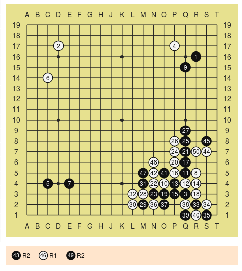

<!-- README.md is generated from README.Rmd. Please edit that file -->
[](https://travis-ci.org/kota7/gogamer)

gogamer: R package for go game data
===================================


Installation and import
-----------------------

Install by

``` r
devtools::install_github("kota7/gogamer")
```

Use by

``` r
library(gogamer)
```

Functionalities
---------------

### Read sgf files

`read_sgf` reads text files written in sgf format, and compiles as a `gogame` class object.

``` r
x <- read_sgf(system.file("extdata/mimiaka.sgf", package = "gogamer"))
class(x)
#> [1] "gogame"
print(x)
#> * Go game *
#> 
#>  White : Genan Inseki (8p)
#>  Black : Kuwabara Shusaku (4p)
#>  Result: B+2 (325 moves)
#> 
#>  komi        : 0
#>  handicap    : 0
#>  board size  : 19
#>  date        : 1846-07-21
```

### Game snapshot

`stateat` function shows the board configuration at an arbitrary move number,

``` r
# argument 'at' specifies the move number
stateat(x, at = 127)
#>      A B C D E F G H J K L M N O P Q R S T
#>     --------------------------------------
#> 19|  + + + + + + + + + @ O O + + + + + + +
#> 18|  + + + @ + + + + + @ O + O + O O @ + +
#> 17|  + + O O + @ + + O @ @ O O + O @ + + +
#> 16|  + + + + + + + + + + + @ @ @ + + @ + +
#> 15|  + + + + + @ + + + + @ + + + + @ @ + +
#> 14|  + + O + + + + + + + + + + + + @ O O +
#> 13|  + + + + + + + + + + + + + O O O @ @ @
#> 12|  + + + + + + + + + + + + + + @ O O O @
#> 11|  + + + + + + + + + @ + + @ O O @ @ @ +
#> 10|  + + + + + + + + + + + + O O @ + @ O +
#>  9|  + + O + + + + + + + + + + + O @ @ O +
#>  8|  + + + + + + + + + + + + + + O @ O @ +
#>  7|  + + + + + + + + + + + + O + O @ O O +
#>  6|  + + O + + + + + + @ + @ O + O @ + + +
#>  5|  + + + + + + @ + O + + @ O @ O @ O + +
#>  4|  + + @ + @ + + @ + + + @ O O @ O O + +
#>  3|  + + + + + @ O @ O + O O @ @ @ @ O O +
#>  2|  + + + + + + @ O + O O + O @ @ + @ O +
#>  1|  + + + + + + + + O + + O + @ + @ + @ +
#> 
#>   move 127 
#>   black captured: 5   white captured: 4 
#>   last move: black K11
#> 
#> 
```

or `plotat` function draws the image.

``` r
plotat(x, at = 127)
```


The image object inherits `ggplot`, hence you can save it with `ggsave` function.

``` r
library(ggplot2)
ggsave("goimage.pdf", width = 5, height = 5)
```

Images are fully customizable.

``` r
plotat(x, at = 127, 
       boardcolor = "gray15", gridcolor = "gray85", starcolor = "gray85",
       blackcolor = "black", whitecolor = "white", stonelinecolor = "gray50",
       axislabels = FALSE, lastmovemarker = 2)
```


### Kifu document

`kifu` function creates an one-page kifu object, which prints on the console as below.

``` r
kifu(x, from = 1, to = 50)
#> Black 1 - White 50 
#> 
#>        A  B  C  D  E  F  G  H  J  K  L  M  N  O  P  Q  R  S  T
#>      ---------------------------------------------------------
#>  19|   +  +  +  +  +  +  +  +  +  +  +  +  +  +  +  +  +  +  +
#>  18|   +  +  +  +  +  +  +  +  +  +  +  +  +  +  +  +  +  +  +
#>  17|   +  +  +  2  +  +  +  +  +  +  +  +  +  +  4  +  +  +  +
#>  16|   +  +  +  +  +  +  +  +  +  +  +  +  +  +  +  +  1  +  +
#>  15|   +  +  +  +  +  +  +  +  +  +  +  +  +  +  +  9  +  +  +
#>  14|   +  +  6  +  +  +  +  +  +  +  +  +  +  +  +  +  +  +  +
#>  13|   +  +  +  +  +  +  +  +  +  +  +  +  +  +  +  +  +  +  +
#>  12|   +  +  +  +  +  +  +  +  +  +  +  +  +  +  +  +  +  +  +
#>  11|   +  +  +  +  +  +  +  +  +  +  +  +  +  +  +  +  +  +  +
#>  10|   +  +  +  +  +  +  +  +  +  +  +  +  +  +  +  +  +  +  +
#>   9|   +  +  +  +  +  +  +  +  +  +  +  +  +  +  + 27  +  +  +
#>   8|   +  +  +  +  +  +  +  +  +  +  +  +  +  + 26 25  + 45  +
#>   7|   +  +  +  +  +  +  +  +  +  +  +  +  +  + 24 21 50 44  +
#>   6|   +  +  +  +  +  +  +  +  +  +  +  + 48  + 20 17  +  +  +
#>   5|   +  +  +  +  +  +  +  +  +  +  + 47 42 41 16 11  8  +  +
#>   4|   +  +  5  +  7  +  +  +  +  +  + 31 22 10 13 12 14  +  +
#>   3|   +  +  +  +  +  +  +  +  +  + 32 28 23 19 15  3 18  +  +
#>   2|   +  +  +  +  +  +  +  +  +  + 30 29 36 37  + 38 33 34  +
#>   1|   +  +  +  +  +  +  +  +  +  +  +  +  +  +  + 39 40 35  + 
#> 
#>   B43=R2; W46=R1; B49=R2
```

`kifuplot` function draws the image. Again, the object supports `ggsave` function.

``` r
kifuplot(x, from = 1, to = 50)
```


