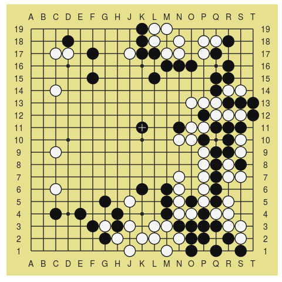

<!-- README.md is generated from README.Rmd. Please edit that file -->
[](https://travis-ci.org/kota7/gogamer)

gogamer: R package for go game data
===================================


How to use
----------

Install by

``` r
devtools::install_github("kota7/gogamer")
```

Use by

``` r
library(gogamer)
```

What you can do
---------------

You can read go game record file in SGF.

``` r
x <- read_sgf(system.file("extdata/mimiaka.sgf", package = "gogamer"))
class(x)
#> [1] "gogame"
print(x)
#> * Go game *
#> 
#>  White : Genan Inseki (8p)
#>  Black : Kuwabara Shusaku (4p)
#>  Result: B+2 (325 moves)
#> 
#>  komi        : 0
#>  handicap    : 0
#>  board size  : 19
#>  date        : 1846-07-21
```

You can print the board configuration on console,

``` r
# argument 'at' specifies the move number
stateat(x, at = 127)
#>      A B C D E F G H J K L M N O P Q R S T
#>     --------------------------------------
#> 19|  + + + + + + + + + @ O O + + + + + + +
#> 18|  + + + @ + + + + + @ O + O + O O @ + +
#> 17|  + + O O + @ + + O @ @ O O + O @ + + +
#> 16|  + + + + + + + + + + + @ @ @ + + @ + +
#> 15|  + + + + + @ + + + + @ + + + + @ @ + +
#> 14|  + + O + + + + + + + + + + + + @ O O +
#> 13|  + + + + + + + + + + + + + O O O @ @ @
#> 12|  + + + + + + + + + + + + + + @ O O O @
#> 11|  + + + + + + + + + @ + + @ O O @ @ @ +
#> 10|  + + + + + + + + + + + + O O @ + @ O +
#>  9|  + + O + + + + + + + + + + + O @ @ O +
#>  8|  + + + + + + + + + + + + + + O @ O @ +
#>  7|  + + + + + + + + + + + + O + O @ O O +
#>  6|  + + O + + + + + + @ + @ O + O @ + + +
#>  5|  + + + + + + @ + O + + @ O @ O @ O + +
#>  4|  + + @ + @ + + @ + + + @ O O @ O O + +
#>  3|  + + + + + @ O @ O + O O @ @ @ @ O O +
#>  2|  + + + + + + @ O + O O + O @ @ + @ O +
#>  1|  + + + + + + + + O + + O + @ + @ + @ +
#> 
#>   move 127 
#>   black captured: 5   white captured: 4 
#>   last move: black K11
#> 
#> 
```

or draw as an image.

``` r
plotat(x, at = 127)
```



The image object inherits `ggplot`, hence you can save it with `ggsave` function.

``` r
library(ggplot2)
ggsave("goimage.pdf", width = 5, height = 5)
```

Images can be edited flexibly.

``` r
plotat(x, at = 127, 
       boardcolor = "gray15", gridcolor = "gray85", starcolor = "gray85",
       blackcolor = "black", whitecolor = "white", stonelinecolor = "gray50",
       axislabels = FALSE, lastmovemarker = 2)
```


You can also draw kifu (game record) image as below. Again, the object supports `ggsave` function.

``` r
plot(kifu(x, from = 1, to = 127))
```


Or you may also print kifu on console.

``` r
kifu(x, from = 1, to = 127)
#> Black 1 - Black 127 
#> 
#>        A  B  C  D  E  F  G  H  J  K  L  M  N  O  P  Q  R  S  T
#>      ---------------------------------------------------------
#>  19|   +  +  +  +  +  +  +  +  +117118114  +  +  +  +  +  +  +
#>  18|   +  +  +119  +  +  +  +  +113112 93 94  +116 74 75  +  +
#>  17|   +  +120  2  + 89  +  + 68115 67 90 92  +  4 69  +  +  +
#>  16|   +  +  +  +  +  +  +  +  +  +  + 91 95 79  +  +  1  +  +
#>  15|   +  +  +  +  +121  +  +  +  + 71  +  +  +  +  9111  +  +
#>  14|   +  +  6  +  +  +  +  +  +  +  +  +  +  +  + 97 96102  +
#>  13|   +  +  +  +  +  +  +  +  +  +  +  +  + 76 72 82 81 99103
#>  12|   +  +  +  +  +  +  +  +  +  +  +  +  +  + 73 80 98100101
#>  11|   +  +  +  +  +  +  +  +  +127  +  + 77108106105 59 55  +
#>  10|   +  +  +  +  +  +  +  +  +  +  +  + 78 70107104 53 54  +
#>   9|   +  + 66  +  +  +  +  +  +  +  +  +  +  +110 27109 56  +
#>   8|   +  +  +  +  +  +  +  +  +  +  +  +  +  + 26 25 52 45  +
#>   7|   +  +  +  +  +  +  +  +  +  +  +  + 58  + 24 21 50 44  +
#>   6|   +  +122  +  +  +  +  +  + 61  + 57 48  + 20 17  +  +  +
#>   5|   +  +  +  +  +  + 65  +126  +  + 47 42 41 16 11  8  +  +
#>   4|   +  +  5  +  7  +  + 87  +  +  + 31 22 10 13 12 14  +  +
#>   3|   +  +  +  +  +125 64 83 86  + 32 28 23 19 15  3 18 60  +
#>   2|   +  +  +  +  +  +123 84 85 88 30 29 36 37 51 38 33 34  +
#>   1|   +  +  +  +  +  +  +  +124  +  + 62  + 63  + 39 40 35  + 
#> 
#>   B43=R2; W46=R1; B49=R2
```
